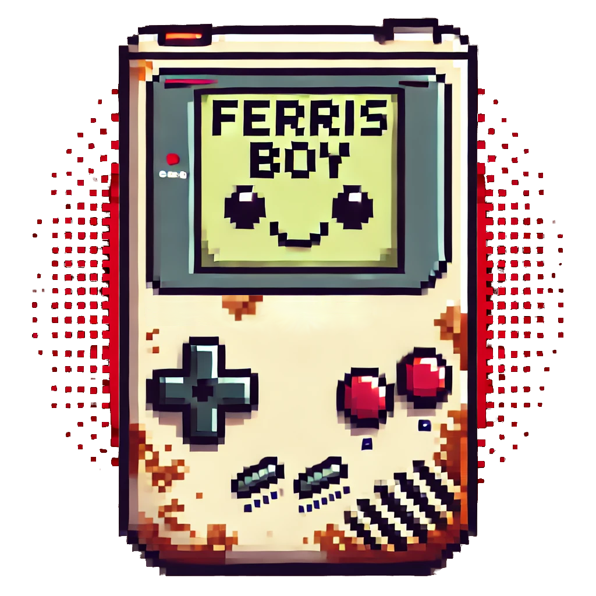

# Ferris Boy

<p align="center">
  
</p>

**Ferris Boy** is an experimental and amateur Game Boy emulator written in **Rust**.

## Getting Started

### Prerequisites

- Install [Rust](https://www.rust-lang.org/tools/install) (latest stable version) and `cargo`
- Set up development environment
  - `make deps`
  - `make hooks`
  - `cargo build`

### Build and Run

Clone the repository and build the emulator:

```sh
git clone https://github.com/scmeek/ferrisboy.git
cd ferrisboy
cargo build --release
```

## License

This project is licensed under the MIT License. See [LICENSE](LICENSE) for details.

## References

### Videos

- [The Ultimate Game Boy Talk (33c3)](https://www.youtube.com/watch?app=desktop&v=HyzD8pNlpwI)
- [Tim Jacobs: Why YOU Should Write a Gameboy Emulator](https://www.youtube.com/watch?app=desktop&v=ElwhYW5wjts&t=841s)

### Docs

- [Pan Docs](https://gbdev.io/pandocs/)
- [Game Boy Development Community](https://gbdev.io)
- [Game Boy CPU (SM83) instruction set](https://gbdev.io/gb-opcodes/optables/)
- [Gameboy CPU (LR35902) instruction set](https://www.pastraiser.com/cpu/gameboy/gameboy_opcodes.html)
- [Gameboy Development Manual V1.1](https://archive.org/details/GameBoyProgManVer1.1)
- [The Cycle-Accurate Game Boy Docs](https://github.com/rockytriton/LLD_gbemu/raw/main/docs/The%20Cycle-Accurate%20Game%20Boy%20Docs.pdf)
- [Game Boy: Complete Technical Reference](https://github.com/rockytriton/LLD_gbemu/raw/main/docs/gbctr.pdf)

### Other Projects

- [Retro Boy](https://github.com/smparsons/retroboy)
  - Excelent reference of tests
- [LLD_gbemu Repo](https://github.com/rockytriton/LLD_gbemu)

### Related

- [Writing NES Emulator in Rust](https://bugzmanov.github.io/nes_ebook/)
